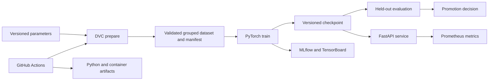

# Architecture

The maintained system separates reproducible research from online inference.
Both paths consume the same immutable checkpoint and signal contract.

## Boundaries and contracts

- Git versions code, parameters and pipeline metadata; DVC versions generated
  datasets and model artifacts.
- Dataset loading validates required arrays, shapes, finite values, sampling
  rate, segment length, non-empty partitions and subject isolation.
- Preparation emits a SHA-256 lineage manifest with schema and split
  cardinalities; DVC independently content-addresses every pipeline output.
- A checkpoint stores its architecture and signal contract. Evaluation and
  online inference reject incompatible sampling rates or window lengths.
- The API loads one model during application startup. Liveness is independent
  of model availability; readiness succeeds only after a valid model is loaded.
- The service exposes aggregate request counts and latency. It never records
  raw ECG samples in metrics or logs.
- Evaluation applies aggregate and worst-stratum gates and persists the complete
  decision. A failed gate is visible evidence, not silently promoted.

The synthetic generator is a reproducible software fixture, not evidence of
clinical performance. An approved real-data adapter must preserve the same
subject/source lineage and privacy boundary.
